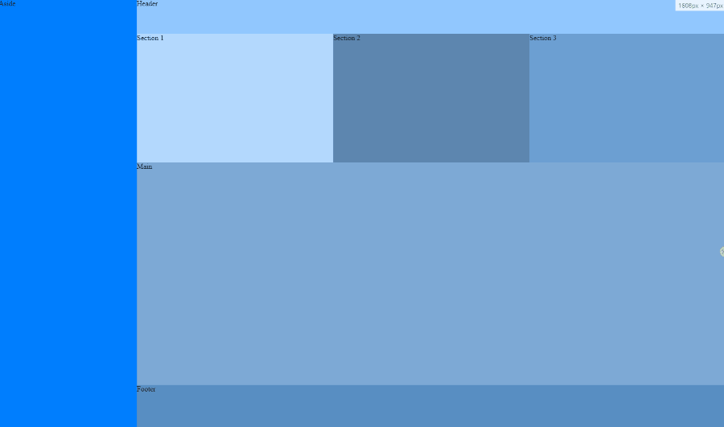

# Grid Template Areas Tutorial Project

This is the project based on the following tutorial: [Easily Structure your Layout with CSS Grid's 'grid-template-areas'](https://www.youtube.com/watch?v=qTGbWfEEnKI&feature=youtu.be)

[Original repo](https://github.com/designcourse/grid-template-areas-tutorial)

# How it looks

