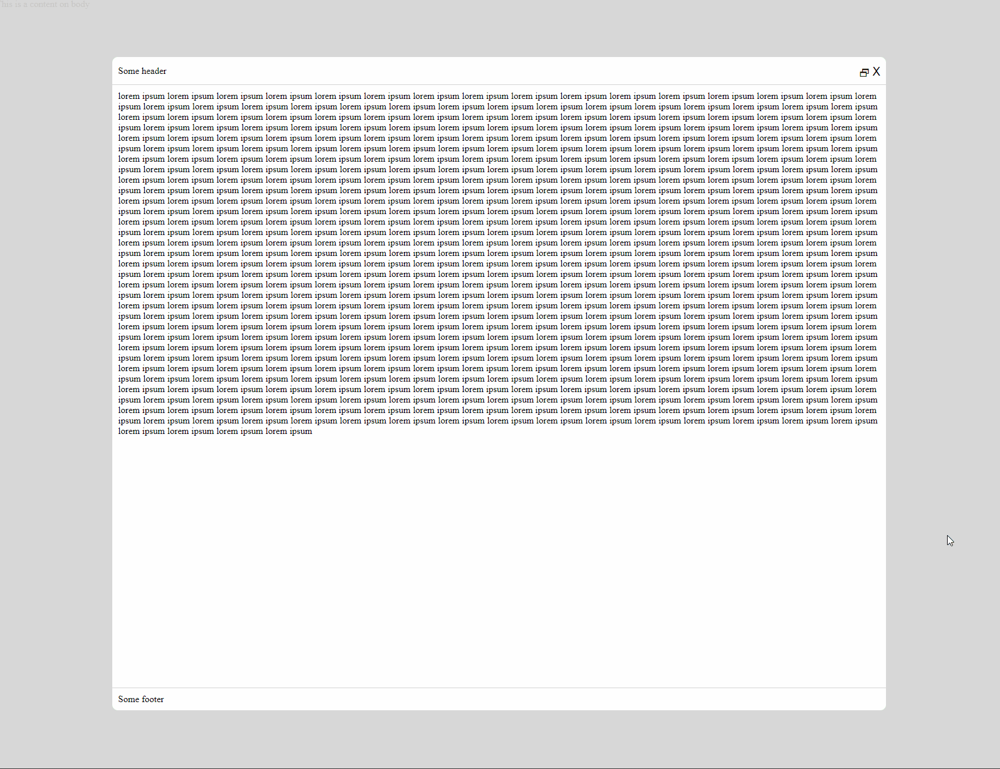

# Modal

This is a simple example of a modal using HTML, CSS and JavaScript.

Features:

- Modal is responsive to screen size
- Close modal by clicking on the X button or pressing the `ESC` key
- Maximize/Minimize the modal by clicking on the maximize button
- Modal content automatically adjusts to the content size

Play with the code on [jsfiddle](https://jsfiddle.net/thxoavsp/).

# How it looks

